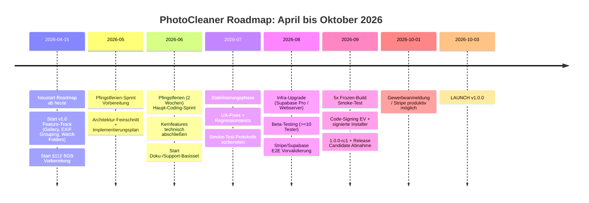

# PhotoCleaner Roadmap 2026 (Neu ab 15. April 2026)

**Stand:** 2. Mai 2026  
**Version:** v0.8.7  
**Launch-Ziel:** v1.0.0 am 3. Oktober 2026  
**Preismodell:** FREE (einmaliger Scan, 250 Bilder) · PRO (29 EUR/Jahr, unbegrenzt)  
**Kritisches Launch-Gate:** 5× Frozen-Build Smoke-Test (EXE + MSI auf sauberen Windows-Systemen)

---

## 1) v1.0 Scope bis Launch (technisch)

### 1.1 Produkt- und Plattform-Features (vor Launch)

- [x] **Gallery-View** (Priorität: Hoch · Zeitraum: Apr-Mai 2026) ✅ ABGESCHLOSSEN
        - [x] Neuer UI-State nach dem Review
        - [x] Keep-Bilder als Galerie statt Liste
        - [x] Finaler Qualitätscheck vor Export direkt in der Galerie

- [x] **EXIF Smart Grouping** (Priorität: Hoch · Zeitraum: Apr-Juni 2026) ✅ DESIGN & ARCHITEKTUR ABGESCHLOSSEN (2. Mai 2026)
        - [x] Architektur-Dokumentation & Designentscheidungen (siehe docs/EXIF_SMART_GROUPING.md)
        - [x] Code-Skelette: NominatimGeocoder, GeocodingCache, ExifGroupingEngine
        - [x] Hybrid Caching (Memory-LRU + SQLite, 7 Tage TTL)
        - [x] Reverse Geocoding via OSM Nominatim mit Rate-Limiting (1 req/sec)
        - [x] Fallback-Hierarchie (GPS → Kamera-Ort → Datum-Cluster → Ungrouped)
        - [x] DB-Schema mit Migrationen (4 neue Tabellen)
        - [x] Implementierungs-Leitfaden mit FILL-Platzhaltern (docs/EXIF_SMART_GROUPING_IMPLEMENTATION_GUIDE.md)
        - [ ] EXIF-Extraktion aus RatingWorkerThread integrieren (nächste Phase: Juni)
        - [ ] DB-Integration (_save_groups_to_db implementation) (nächste Phase: Juni)
        - [ ] UI-Integration: Gallery-Filter + Map-Visualisierung (nächste Phase: Juni-Juli)

- [x] **Watch Folders / Auto-Import** (Priorität: Hoch · Zeitraum: Mai-Juni 2026) ✅ DESIGN & ARCHITEKTUR ABGESCHLOSSEN (2. Mai 2026)
        - [x] Architektur-Dokumentation & Designentscheidungen (siehe docs/WATCHFOLDERS_AUTOIMPORT.md)
        - [x] Code-Skelette: WatchfolderMonitor, DebouncedEventHandler, AutoimportPipeline, Controller
        - [x] Unit-Tests Framework (pytest + qtbot, 15+ Tests)
        - [x] Implementierungs-Leitfaden mit Copy-Paste-Code-Snippets (docs/WATCHFOLDERS_IMPLEMENTATION_GUIDE.md)
        - [x] E2E-Test-Szenarien & Troubleshooting-Guide
        - [ ] Integration in modern_window.py (nächste Phase: Juni)
        - [ ] DuplicateFinder/RatingWorker-Integration in Pipeline (nächste Phase: Juni)
        - [ ] End-to-End Testing & Performance-Optimierung (nächste Phase: Juni-Juli)

- [ ] **Pre-Release UX-Fixes** (Priorität: Mittel · Zeitraum: Mai-Juli 2026)
        - [x] Theme-Audit-Restlauf abgeschlossen (siehe scripts/theme_audit.py)
        - [x] UI-Snapshot-Smoke Dark/Light/Dark abgeschlossen (siehe scripts/ui_snapshot_smoke.py)
        - [x] Analyse-Progressbar ohne Ruecksprung zwischen "Finalisierung" und "Bilder bewerten" stabilisiert
        - [x] Duplikat-Ranking mit Klasse-A-Markierung (Kopie-Dateien als bevorzugte Loeschkandidaten)
        - [x] Regressions-Check: 3 komplette Analyselaeufe ohne Progress/Status-Spruenge (siehe scripts/pre_release_regression_check.py --runs 3)
        - [x] ✅ **1. Mai 2026 - Critical UX Stability Fixes durchgeführt:**
                - [x] **Thumbnail Race Condition** (Priorität: Kritisch)
                        - **Problem**: Viele Thumbnails erschienen gleichzeitig, überlappend mit alten Einträgen
                        - **Ursache**: ThumbnailLoader-Worker-Ergebnisse aus alten Render-Zyklen wurden auf neue Karten angewendet
                        - **Lösung**: 
                            - Modified `ThumbnailLoader.thumbnail_loaded` signal to include source file path
                            - Updated `GalleryView._on_thumb_loaded()` callback to validate path matches current card
                            - Stale results are silently discarded with debug logging
                        - **Dateien**: [src/photo_cleaner/ui/thumbnail_lazy.py](src/photo_cleaner/ui/thumbnail_lazy.py), [src/photo_cleaner/ui/gallery/gallery_view.py](src/photo_cleaner/ui/gallery/gallery_view.py)
                
                - [x] **Gallery nicht aktualisiert nach Export** (Priorität: Kritisch)
                        - **Problem**: Manueller App-Neustart erforderlich, um exportierte Bilder in Gallery zu sehen
                        - **Ursache**: Export-Finalisierung refreshte nur Review-Seite, nicht Gallery-Datencache
                        - **Lösung**: 
                            - Created `_refresh_gallery_data()` method in ModernMainWindow
                            - Called after `_finalize_and_export()` completion
                            - Called after `_confirm_delete_marked()` completion
                        - **Datei**: [src/photo_cleaner/ui/modern_window.py](src/photo_cleaner/ui/modern_window.py) (Zeilen ~5377, 9064, 9110)
                
                - [x] **Auto-Switch zu Review bei Analyse-Start** (Priorität: Hoch)
                        - **Problem**: App sprang nach Scan-Start auf Import-Dialog zurück statt im Duplicate-Review zu bleiben
                        - **Ursache**: Keine automatische View-Umschaltung nach Indexierung
                        - **Lösung**: 
                            - Added `self._open_review()` call in `_start_post_indexing_analysis()` method
                            - Ensures users land directly in Review while analysis continues in background
                        - **Datei**: [src/photo_cleaner/ui/modern_window.py](src/photo_cleaner/ui/modern_window.py) (Zeile ~4345)
                
                - [x] **Unwanted Re-Analysis nach Finalisierung** (Priorität: Mittel)
                        - **Problem**: App re-analysierte alles nach Export-Finalisierung
                        - **Ursache**: FolderSelectionDialog Start/Cancel-Buttons waren default buttons; Enter-Taste triggerte sie erneut
                        - **Lösung**: 
                            - Disabled default button roles on both start and cancel buttons
                            - Set `setAutoDefault(False)` and `setDefault(False)` on buttons
                        - **Datei**: [src/photo_cleaner/ui/modern_window.py](src/photo_cleaner/ui/modern_window.py) (Zeilen 1532, 1544)
                
                - [x] **Missing get_language() Import Fix** (Priorität: Mittel)
                        - **Problem**: NameError in First-Run-Setup Flow
                        - **Lösung**: Added missing `get_language()` import
                        - **Datei**: [src/photo_cleaner/ui/modern_window.py](src/photo_cleaner/ui/modern_window.py)
        
        - **Status der Stabilisierung**: Alle 5 kritischen UX-Bugs behoben und validiert ✅

### 1.2 Release-Engineering und Qualität

- [ ] **5× Frozen-Build Smoke-Test** (Priorität: Kritisch · Zeitraum: Juli-September 2026)
        - [ ] EXE + MSI auf sauberen Win10/Win11-Maschinen testen
        - [ ] Install / Upgrade / Uninstall protokollieren
        - [ ] 5/5 Durchläufe ohne kritische Fehler

- [ ] **Stripe + Supabase E2E-Validierung** (Priorität: Hoch · Zeitraum: August-September 2026)
        - [ ] Kauf -> Aktivierung -> Ablauf -> Erneuerung
        - [ ] Fehlerpfade dokumentiert (Timeout, Retry, Webhook-Sonderfälle)

- [ ] **Code-Signing** (Priorität: Hoch · Zeitraum: August-September 2026)
        - [ ] EV-Zertifikat beantragen
        - [ ] EXE + MSI mit Timestamp signieren

- [ ] **Dokumentation finalisieren** (Priorität: Mittel · Zeitraum: Juni-September 2026)
        - [ ] User Manual
        - [ ] FAQ
        - [ ] Troubleshooting Guide

- [ ] **Support-Setup** (Priorität: Mittel · Zeitraum: Juni-September 2026)
        - [ ] E-Mail-Templates vorbereiten
        - [ ] Bug-Melde-Prozess definieren
        - [ ] Triage-Flow festlegen

- [ ] **Release-Kandidaten-Setup** (Priorität: Hoch · Zeitraum: Ende September 2026)
        - [ ] Version auf 1.0.0-rc1 bumpen
        - [ ] Git-Tag setzen

### 1.3 Definition of Done für v1.0

- [ ] Alle drei neuen Kernfeatures stabil produktiv (Gallery, EXIF Grouping, Watch Folders)
- [ ] Kritisches Gate erfüllt: 5/5 Smoke-Tests bestanden
- [ ] Signierte Installer (EXE/MSI) + dokumentierter Recovery-Pfad
- [ ] Support- und Doku-Paket veröffentlichungsbereit

---

## 2) Post-Launch Roadmap (v1.1+)

### 2.1 Phase A (direkt nach Launch · Q4 2026)

- [ ] RAW-Support (CR2, NEF, ARW; optional RAF/DNG)
- [ ] Blur-Ursachen-Differenzierung (Motion vs Fokus vs Verwacklung)
- [ ] Basic Editing (Crop + Belichtung/Kontrast)
- [ ] UX-Paket: Regret Protection, Vergleichsmodus, Speicherplatz-Preview
- [ ] Statistik-Dashboard (PRO)

### 2.2 Phase B (Q1 2027)

- [ ] Best-of-Day Automatik
- [ ] Batch-Rename nach EXIF-Schema
- [ ] KI-Bearbeitungsvorschläge (z. B. Unterbelichtung +20% empfohlen)

### 2.3 Phase C (Q2 2027)

- [ ] Personen-Clustering
- [ ] GPS-Kartenansicht
- [ ] Video-Duplikaterkennung

---

## 3) Rechtliches & Organisatorisches

### 3.1 Rechtliche Schritte

- [ ] **§112 BGB Antrag** (Priorität: Hoch · Zeitraum: April-Juni 2026)
        - [ ] Freiformulierter Brief vorbereiten
        - [ ] Unterschriften: Gründer + beide Eltern
        - [ ] Anhänge: Businessplan + Schul-Kompatibilitätserklärung
        - [ ] Einreichung vor den Sommerferien

- [ ] **Gewerbeanmeldung** (Priorität: Kritisch · Zeitraum: ab 1. Oktober 2026)

- [ ] **Stripe produktiv schalten** (Priorität: Kritisch · Zeitraum: ab 1. Oktober 2026)

### 3.2 Infrastruktur & Go-to-Market Vorbereitung

- [ ] Supabase Pro / Webserver-Upgrade (Priorität: Hoch · Zeitraum: August 2026)
- [ ] Beta-Tester-Rekrutierung (mind. 10 aktive Tester) (Priorität: Hoch · Zeitraum: Mai-August 2026)
- [ ] Beta-Feedback-Zyklus mit klarer Bug-/UX-Klassifizierung (Priorität: Mittel · Zeitraum: Juni-September 2026)

---

## 4) Zeitplan & Meilensteine

---

## 5) Fokusregeln bis Launch

- [ ] Kein Scope-Creep außerhalb v1.0-Kernfeatures
- [ ] Jede neue Aufgabe muss direkt auf Launch-Ziel einzahlen
- [ ] Kritisches Gate hat Vorrang vor allen Nice-to-have-Arbeiten
- [ ] Post-Launch-Features bleiben strikt in Phase A/B/C

---

## 6) Kompakte Launch-Checkliste (T-30 bis T-0)

- [ ] Finales v1.0 Feature-Freeze (Anfang September 2026)
- [ ] 5/5 Smoke-Tests abgeschlossen und protokolliert (bis Ende September 2026)
- [ ] Signierte EXE/MSI + Install/Upgrade/Uninstall freigegeben (bis Ende September 2026)
- [ ] Doku + FAQ + Troubleshooting + Support-Prozess livebereit (bis Ende September 2026)
- [ ] 1.0.0-rc1 Tag + Go/No-Go Entscheidung (letzte Septemberwoche)
- [ ] Launch-Release v1.0.0 (3. Oktober 2026)

---

Diese Roadmap startet bei Null und enthält nur die offenen, kommenden Arbeiten ab dem 15. April 2026.
