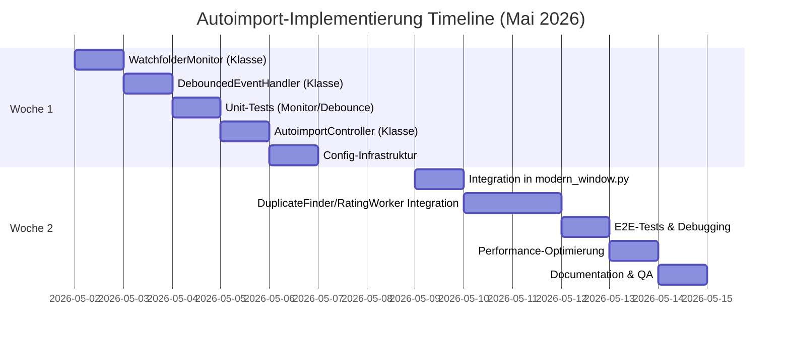

# Watchfolders & Autoimport: Implementierungshandbuch

**Datum:** Mai 2026  
**Version:** 1.0.0-draft  
**Sprache:** Deutsch  
**Zielplattform:** Windows 10/11  
**Tech-Stack:** PySide6, Python 3.10+, SQLite, watchdog/QFileSystemWatcher

---

## Inhaltsverzeichnis

1. [Architekturübersicht](#1-architekturübersicht)
2. [Designentscheidungen](#2-designentscheidungen)
3. [Komponenten & Klassen](#3-komponenten--klassen)
4. [Konfiguration](#4-konfiguration)
5. [Code-Beispiele](#5-code-beispiele)
6. [Integration in Bestehende Infrastruktur](#6-integration-in-bestehende-infrastruktur)
7. [Testplan](#7-testplan)
8. [Troubleshooting & Windows-Spezifika](#8-troubleshooting--windows-spezifika)
9. [Deployment & Rollout](#9-deployment--rollout)

---

## 1. Architekturübersicht

### 1.1 Komponenten-Diagramm

```
┌─────────────────────────────────────────────────────────────────┐
│                    PhotoCleaner UI (PySide6)                      │
│                   (modern_window.py)                              │
└──────────────┬──────────────────────────────────────────────────┘
               │
               ├─→ FolderSelectionDialog
               │   ↓
               │   [Watchfolders aktivieren / konfigurieren]
               │
               └─→ AutoimportController (neu)
                   ├─→ WatchfolderMonitor (QFileSystemWatcher-Wrapper)
                   │   └─→ [Signalisiert Dateiänderungen]
                   │
                   ├─→ DebouncedEventHandler
                   │   ├─→ Timer (debounce window: 2-5s)
                   │   ├─→ Event-Sammlungspuffer
                   │   └─→ [Verhindert Race-Conditions]
                   │
                   └─→ AutoimportPipeline
                       ├─→ FileFilter
                       │   └─→ [Nur neue Bilder: .jpg, .png, .raw, etc.]
                       │
                       ├─→ QuotaValidator (für FREE-Lizenzen)
                       │   └─→ [Prüft 250er-Limit gegen neue Bilder]
                       │
                       ├─→ DuplicateFinder (existierend)
                       │   └─→ [Findet Duplikate in neuen Bildern]
                       │
                       ├─→ RatingWorkerThread (existierend)
                       │   └─→ [Bewertet neue Bilder: Schärfe, Augen, etc.]
                       │
                       └─→ AutoAnalysisResult
                           └─→ [Speichert: gefundene Duplikate, Ratings]
```

### 1.2 Workflow: Vom Datei-Event zur Analyse

```
1. Windows-Filesystem-Event
   ├─→ Datei hinzugefügt: photo_001.jpg
   └─→ Path: C:\MyPhotos\Trip2026\photo_001.jpg

2. WatchfolderMonitor erkennt Event
   └─→ Signalisiert: "fileAdded(path)"

3. DebouncedEventHandler sammelt Events
   ├─→ Startet Timer: 2-5 Sekunden
   ├─→ Sammelt alle neuen Dateien in Zwischenpuffer
   └─→ [Verhindert: 5× Signale für 1 Datei]

4. Nach Debounce-Fenster ablaufen:
   └─→ Signalisiert: "analysisRequested(file_list)"

5. AutoimportPipeline validiert & filtert
   ├─→ Prüft Bildformat (Whitelist)
   ├─→ Prüft Quotas (FREE-Lizenz: 250 max)
   └─→ Erstellt: FileIndex für neue Dateien

6. DuplicateFinder läuft
   ├─→ Holt SHA256/pHash der neuen Bilder
   ├─→ Vergleicht mit bestehenden DB-Einträgen
   └─→ Markiert Duplikate

7. RatingWorkerThread läuft
   ├─→ EXIF-Extraktion (Datum, GPS, Kamera)
   ├─→ Qualitätsbewertung (Schärfe, Lichter-/Schattenwerte, Augen)
   └─→ Speichert Ergebnisse in DB

8. UI aktualisiert automatisch (falls offen)
   ├─→ Gallery zeigt neue Duplikate
   ├─→ Review wechselt zu neuen Bildern (optional)
   └─→ Logging: "✓ 15 Bilder aus Trip2026/ importiert"
```

---

## 2. Designentscheidungen

### 2.1 Folder Monitoring: QFileSystemWatcher vs watchdog

**Gewählt: QFileSystemWatcher** (mit fallback zu watchdog bei Problemen)

**Begründung:**
- ✅ Qt-nativ, bereits in PySide6 vorhanden
- ✅ Keine zusätzliche Abhängigkeit
- ✅ Signal/Slot-Integration direkt mit Qt-Event-Loop
- ✅ Aureichend stabil für Windows 10/11
- ⚠️ Limitation: Max. ~10.000 Dateien pro Ordner auf Windows (akzeptabel)

**Fallback-Strategie:**
- Falls QFileSystemWatcher zu langsam/unzuverlässig: watchdog-Bibliothek optional installierbar
- Config-Key: `use_watchdog: false` (default) → kann auf `true` gesetzt werden

### 2.2 Debounce-Logik & Fenstersize

**Gewählt: 3-5 Sekunden Timer mit kontinuierlichem Reset**

**Szenarien:**
- **Einzelne Datei:** 1 Event → 3s Timer → Analyse
- **Batch-Kopier (z.B. 50 Dateien):** Multiple Events über ~10s → kontinuierlich resetterter Timer → Nach Ende: 1× Analyse für alle 50
- **Kontinuierlicher Upload:** Timer-Reset nach jedem Event (verhindert Analyse bis Upload endet)

**Windows-Spezifika:**
- NTFS sendet oft Duplikat-Events (datei_erstellt, metadaten_geändert, größe_final)
- Lösung: Datei-Existenz + Größen-Stabilität prüfen vor Analyse

### 2.3 Konfigurationsort & Persistierung

**Gewählt: AppConfig + separate `watchfolders.json`**

**Struktur:**
```
AppConfig (Haupt-Settings):
  ├─ watchfolders_enabled: bool (global on/off)
  ├─ debounce_window_ms: int (default 3000)
  └─ auto_analyze: bool (default true)

watchfolders.json (Ordner-spezifisch):
  └─ [
       {"path": "C:\\MyPhotos", "enabled": true, "label": "Holiday 2026"},
       {"path": "D:\\Camera Upload", "enabled": false, "label": "Camera"}
     ]
```

**Speicherort:**
```
%APPDATA%\PhotoCleaner\
├─ app_config.json (existierend)
├─ watchfolders.json (neu)
└─ watchfolders_log.txt (täglich, rotierend)
```

### 2.4 FREE-Lizenz Quota-Handling

**Logik:**
1. Bestehende Limit-Check bleibt: 250 Bilder pro Scan-Session
2. **NEU:** Autoimport-Scan prüft verfügbare Quota vor Analyse
3. Falls Quota überschritten: 
   - Nicht blockieren, sondern **warnen** + nur bis Limit analysieren
   - Beispiel: 200/250 verfügbar → analysiere nur erste 200 neuer Bilder

**Implementierung:**
```python
remaining = tracker.get_remaining()
if len(new_files) > remaining:
    logger.warning(f"Autoimport: {len(new_files)} Bilder erkannt, "
                   f"aber nur {remaining}/250 FREE-Quota verfügbar. "
                   f"Analysiere nur {remaining} Bilder.")
    new_files = new_files[:remaining]
```

---

## 3. Komponenten & Klassen

### 3.1 `WatchfolderMonitor` (Wrapper um QFileSystemWatcher)

**Datei:** `src/photo_cleaner/autoimport/watchfolder_monitor.py`

**Verantwortung:**
- Registriert/deregistriert Watchfolders
- Emitiert Signale bei Dateiänderungen
- Puffert Events für Debounce-Handler

**Schnittstellen:**
```python
class WatchfolderMonitor(QObject):
    """Qt-basierter Watchfolder-Monitor mit Multi-Path-Support."""
    
    # Signale
    file_added = pyqtSignal(str)  # path
    file_modified = pyqtSignal(str)  # path
    file_removed = pyqtSignal(str)  # path
    error_occurred = pyqtSignal(str)  # error message
    
    def __init__(self):
        super().__init__()
        self._watcher = QFileSystemWatcher()
        self._watcher.fileChanged.connect(self._on_file_changed)
        self._watcher.directoryChanged.connect(self._on_directory_changed)
        self._watched_paths = {}  # {path: label}
    
    def add_watchfolder(self, folder_path: Path, label: str = None) -> bool:
        """Registriert einen Watchfolder. Returns: True wenn erfolgreich."""
        if not folder_path.is_dir():
            self.error_occurred.emit(f"Path not a directory: {folder_path}")
            return False
        
        try:
            self._watcher.addPath(str(folder_path))
            self._watched_paths[str(folder_path)] = label or folder_path.name
            return True
        except Exception as e:
            self.error_occurred.emit(f"Failed to watch {folder_path}: {e}")
            return False
    
    def remove_watchfolder(self, folder_path: Path) -> bool:
        """Deregistriert einen Watchfolder."""
        try:
            self._watcher.removePath(str(folder_path))
            del self._watched_paths[str(folder_path)]
            return True
        except Exception as e:
            self.error_occurred.emit(f"Failed to unwatch {folder_path}: {e}")
            return False
    
    def get_watched_paths(self) -> dict:
        """Returns {path: label} für alle überwachten Ordner."""
        return self._watched_paths.copy()
    
    def _on_directory_changed(self, path: str):
        """Qt-Slot: Verzeichnis hat sich geändert."""
        # Enumerate alle Dateien im Verzeichnis und emit file_added für neue
        try:
            path_obj = Path(path)
            for file_path in path_obj.iterdir():
                if file_path.is_file() and self._is_image(file_path):
                    self.file_added.emit(str(file_path))
        except Exception as e:
            self.error_occurred.emit(f"Error enumerating {path}: {e}")
    
    def _on_file_changed(self, path: str):
        """Qt-Slot: Datei wurde geändert."""
        # Ignorieren für Autoimport (wir interessieren uns nur für Hinzufügen)
        pass
    
    @staticmethod
    def _is_image(path: Path) -> bool:
        """Whitelist-Check für Bildformate."""
        return path.suffix.lower() in {'.jpg', '.jpeg', '.png', '.gif', 
                                       '.bmp', '.tiff', '.raw', '.cr2', '.nef', '.arw'}
```

### 3.2 `DebouncedEventHandler` (Debounce-Logik)

**Datei:** `src/photo_cleaner/autoimport/debounced_event_handler.py`

**Verantwortung:**
- Sammelt Events in Zwischenpuffer
- Startet/resettet Timer
- Emitiert gebündelte Events nach Debounce-Fenster

**Schnittstellen:**
```python
class DebouncedEventHandler(QObject):
    """Debounce-Handler für Filesystem-Events."""
    
    # Signale
    analysis_requested = pyqtSignal(list)  # list of file paths
    
    def __init__(self, debounce_ms: int = 3000):
        super().__init__()
        self.debounce_ms = debounce_ms
        self._event_buffer = set()
        self._debounce_timer = QTimer()
        self._debounce_timer.timeout.connect(self._on_timer_expired)
        self._debounce_timer.setSingleShot(True)
    
    def handle_event(self, file_path: str):
        """Registriert ein neues Event."""
        self._event_buffer.add(file_path)
        
        # Timer resetten (continous reset = Fenster wird um 3s verschoben)
        if self._debounce_timer.isActive():
            self._debounce_timer.stop()
        self._debounce_timer.start(self.debounce_ms)
    
    def _on_timer_expired(self):
        """Qt-Slot: Debounce-Fenster ist abgelaufen."""
        if self._event_buffer:
            files = list(self._event_buffer)
            self._event_buffer.clear()
            
            # Filter: Nur Dateien, die noch existieren (verhindert race conditions)
            existing = [f for f in files if Path(f).exists()]
            
            if existing:
                self.analysis_requested.emit(existing)
    
    def set_debounce_window(self, ms: int):
        """Ändert das Debounce-Fenster (zur Laufzeit)."""
        self.debounce_ms = ms
    
    def flush(self):
        """Sofort verarbeiten (z.B. beim Shutdown)."""
        if self._debounce_timer.isActive():
            self._debounce_timer.stop()
        self._on_timer_expired()
```

### 3.3 `AutoimportPipeline` (Orchestrierung)

**Datei:** `src/photo_cleaner/autoimport/autoimport_pipeline.py`

**Verantwortung:**
- Validiert neue Bilder (Format, Quota)
- Triggert DuplicateFinder + RatingWorkerThread
- Speichert Ergebnisse
- Signalisiert UI-Updates

**Schnittstellen:**
```python
class AutoimportPipeline(QObject):
    """Orchestriert Analyse-Pipeline für neue Bilder."""
    
    # Signale
    import_started = pyqtSignal(int)  # count of files
    import_progress = pyqtSignal(int, int)  # current, total
    import_completed = pyqtSignal(dict)  # result summary
    import_error = pyqtSignal(str)  # error message
    
    def __init__(self, db_path: Path, config: AppConfig, license_manager):
        super().__init__()
        self.db_path = db_path
        self.config = config
        self.license_manager = license_manager
        self.usage_tracker = get_usage_tracker()  # Existing FREE-quota tracker
        
        self._is_running = False
        self._duplicate_finder = None
        self._rating_worker = None
    
    def analyze_files(self, file_paths: list[str]):
        """Startet Analyse für neue Dateien."""
        if self._is_running:
            logger.warning("Autoimport: Analyse läuft bereits, ignoriere neue Anfrage")
            return
        
        # Validierung
        valid_files = self._validate_and_filter(file_paths)
        if not valid_files:
            logger.info("Autoimport: Keine neuen Bilder nach Filterung")
            return
        
        self._is_running = True
        self.import_started.emit(len(valid_files))
        
        try:
            # 1. Duplikate finden
            logger.info(f"Autoimport: Starten Duplikaterkennung für {len(valid_files)} Bilder")
            duplicates = self._find_duplicates(valid_files)
            
            # 2. Ratings durchführen
            logger.info(f"Autoimport: Starten Qualitätsbewertung")
            self._rate_images(valid_files)
            
            # 3. Ergebnis zusammenfassen
            result = {
                "total_files": len(valid_files),
                "duplicates_found": len(duplicates),
                "duplicates": duplicates,
                "timestamp": datetime.now().isoformat()
            }
            
            self.import_completed.emit(result)
            
        except Exception as e:
            logger.error(f"Autoimport: Fehler in Pipeline: {e}", exc_info=True)
            self.import_error.emit(str(e))
        finally:
            self._is_running = False
    
    def _validate_and_filter(self, file_paths: list[str]) -> list[str]:
        """Validiert Dateien, Formate und Quotas."""
        valid = []
        
        # 1. Format-Check
        for path_str in file_paths:
            path = Path(path_str)
            if not path.is_file():
                logger.debug(f"Autoimport: Datei nicht vorhanden: {path}")
                continue
            if path.suffix.lower() not in {'.jpg', '.jpeg', '.png', '.raw', '.gif'}:
                logger.debug(f"Autoimport: Format nicht unterstützt: {path.suffix}")
                continue
            valid.append(str(path))
        
        # 2. Quota-Check (nur für FREE-Lizenzen)
        if self.license_manager.license_type == LicenseType.FREE:
            can_scan, remaining = self.usage_tracker.can_scan(len(valid))
            if not can_scan:
                logger.warning(f"Autoimport: FREE-Quota überschritten. "
                              f"Begrenze auf {remaining} Bilder.")
                valid = valid[:remaining]
        
        logger.info(f"Autoimport: {len(valid)} gültige Bilder nach Filterung")
        return valid
    
    def _find_duplicates(self, file_paths: list[str]) -> list[dict]:
        """Führt Duplikaterkennung durch (synchron, mit Progress-Updates)."""
        # [FILL: Integration mit existierendem DuplicateFinder]
        # Returns: [{"path": "...", "duplicate_of": "...", "class": "A|B"}, ...]
        pass
    
    def _rate_images(self, file_paths: list[str]):
        """Führt Qualitätsbewertung durch (synchron)."""
        # [FILL: Integration mit existierendem RatingWorkerThread]
        # Speichert Ergebnisse direkt in DB
        pass
```

### 3.4 `AutoimportController` (Hauptkoordinator)

**Datei:** `src/photo_cleaner/autoimport/autoimport_controller.py`

**Verantwortung:**
- Koordiniert alle Komponenten
- Lädt/speichert Konfiguration
- Verwaltet Startup/Shutdown
- Logging

**Schnittstellen:**
```python
class AutoimportController(QObject):
    """Hauptkoordinator für Watchfolders & Autoimport."""
    
    # Signale (für UI)
    status_changed = pyqtSignal(str)  # status message
    import_complete = pyqtSignal(dict)  # result summary
    
    def __init__(self, db_path: Path, config: AppConfig, license_manager, parent=None):
        super().__init__(parent)
        self.db_path = db_path
        self.config = config
        self.license_manager = license_manager
        
        self._monitor = WatchfolderMonitor()
        self._debouncer = DebouncedEventHandler(debounce_ms=3000)
        self._pipeline = AutoimportPipeline(db_path, config, license_manager)
        
        # Signale verbinden
        self._monitor.file_added.connect(self._debouncer.handle_event)
        self._debouncer.analysis_requested.connect(self._on_analysis_requested)
        self._pipeline.import_completed.connect(self._on_import_completed)
        
        self._watchfolders_config_file = Path.home() / "AppData" / "Roaming" / \
                                         "PhotoCleaner" / "watchfolders.json"
        
        self._enabled = False
    
    def startup(self):
        """Initialisiert und startet Autoimport."""
        if self.config.autoimport_enabled:
            logger.info("Autoimport: Starten")
            self._load_watchfolders()
            self._enabled = True
            self.status_changed.emit("Autoimport aktiv")
    
    def shutdown(self):
        """Beendet Autoimport graceful."""
        logger.info("Autoimport: Herunterfahren")
        self._debouncer.flush()  # Verarbeite offene Events
        self._enabled = False
        self.status_changed.emit("Autoimport deaktiviert")
    
    def add_watchfolder(self, folder_path: Path, label: str = None) -> bool:
        """Fügt einen Watchfolder hinzu."""
        result = self._monitor.add_watchfolder(folder_path, label)
        if result:
            self._save_watchfolders()
        return result
    
    def remove_watchfolder(self, folder_path: Path) -> bool:
        """Entfernt einen Watchfolder."""
        result = self._monitor.remove_watchfolder(folder_path)
        if result:
            self._save_watchfolders()
        return result
    
    def get_watchfolders(self) -> list[dict]:
        """Gibt alle konfigurierten Watchfolders zurück."""
        return [
            {"path": path, "label": label}
            for path, label in self._monitor.get_watched_paths().items()
        ]
    
    def _load_watchfolders(self):
        """Lädt Watchfolders aus Konfigurationsdatei."""
        if not self._watchfolders_config_file.exists():
            logger.debug("Autoimport: Keine Watchfolders konfiguriert")
            return
        
        try:
            with open(self._watchfolders_config_file) as f:
                config = json.load(f)
            
            for folder_config in config.get("folders", []):
                if folder_config.get("enabled", True):
                    self._monitor.add_watchfolder(
                        Path(folder_config["path"]),
                        folder_config.get("label")
                    )
        except Exception as e:
            logger.error(f"Autoimport: Fehler beim Laden der Konfiguration: {e}")
    
    def _save_watchfolders(self):
        """Speichert aktuell überwachte Watchfolders."""
        self._watchfolders_config_file.parent.mkdir(parents=True, exist_ok=True)
        
        config = {
            "folders": [
                {"path": path, "label": label, "enabled": True}
                for path, label in self._monitor.get_watched_paths().items()
            ]
        }
        
        with open(self._watchfolders_config_file, 'w') as f:
            json.dump(config, f, indent=2, ensure_ascii=False)
    
    def _on_analysis_requested(self, file_paths: list[str]):
        """Qt-Slot: Debouncer signalisiert zu analysierende Dateien."""
        if not self._enabled:
            return
        
        logger.info(f"Autoimport: Analyse angefordert für {len(file_paths)} Dateien")
        self._pipeline.analyze_files(file_paths)
    
    def _on_import_completed(self, result: dict):
        """Qt-Slot: Pipeline hat Analyse abgeschlossen."""
        logger.info(f"Autoimport: Abgeschlossen. "
                   f"{result['total_files']} Dateien, "
                   f"{result['duplicates_found']} Duplikate gefunden")
        self.import_complete.emit(result)
```

---

## 4. Konfiguration

### 4.1 `app_config.json` - Neue Parameter

**Datei:** `%APPDATA%\PhotoCleaner\app_config.json`

```json
{
  "theme": "dark",
  "language": "de",
  
  "autoimport": {
    "enabled": false,
    "debounce_window_ms": 3000,
    "auto_analyze": true,
    "log_level": "INFO"
  },
  
  "performance": {
    "use_watchdog": false,
    "max_concurrent_analyses": 1
  }
}
```

### 4.2 `watchfolders.json` - Folder-Konfiguration

**Datei:** `%APPDATA%\PhotoCleaner\watchfolders.json`

```json
{
  "version": "1.0",
  "created_at": "2026-05-02T10:30:00",
  "folders": [
    {
      "path": "C:\\Users\\Chris\\Pictures\\Holiday2026",
      "label": "Urlaub 2026",
      "enabled": true,
      "created_at": "2026-05-02T09:00:00"
    },
    {
      "path": "D:\\CameraUpload",
      "label": "Kamera Auto-Upload",
      "enabled": true,
      "created_at": "2026-05-01T14:30:00"
    },
    {
      "path": "\\\\NAS\\SharedPhotos",
      "label": "NAS Gemeinsam",
      "enabled": false,
      "created_at": "2026-04-25T11:00:00"
    }
  ]
}
```

### 4.3 Logging-Konfiguration

**Datei:** `%APPDATA%\PhotoCleaner\logging.json`

```json
{
  "version": 1,
  "autoimport": {
    "file": "watchfolders_autoimport.log",
    "max_bytes": 5242880,
    "backup_count": 5,
    "format": "%(asctime)s [%(levelname)s] %(name)s: %(message)s"
  }
}
```

**Log-Rotationsbeispiele:**
```
watchfolders_autoimport.log          (aktuell)
watchfolders_autoimport.log.1        (gestern)
watchfolders_autoimport.log.2        (vor 2 Tagen)
...
watchfolders_autoimport.log.5        (vor 5 Tagen, dann gelöscht)
```

---

## 5. Code-Beispiele

### 5.1 Minimales Standalone-Beispiel (zum Testen)

**Datei:** `scripts/test_autoimport_standalone.py`

```python
#!/usr/bin/env python3
"""
Standalone-Testskript für Autoimport-Komponenten (ohne Full PhotoCleaner UI).
Nützlich für Unit-Tests und Debugging.
"""

import sys
import json
import logging
from pathlib import Path
from PySide6.QtCore import QCoreApplication, QTimer

# Konfiguriere Logging
logging.basicConfig(
    level=logging.DEBUG,
    format='%(asctime)s [%(levelname)s] %(name)s: %(message)s'
)
logger = logging.getLogger(__name__)

# Importiere Autoimport-Komponenten
sys.path.insert(0, str(Path(__file__).parent.parent / "src"))
from photo_cleaner.autoimport.watchfolder_monitor import WatchfolderMonitor
from photo_cleaner.autoimport.debounced_event_handler import DebouncedEventHandler


def test_watchfolder_monitor():
    """Test 1: Watchfolder-Monitoring"""
    logger.info("=== Test 1: WatchfolderMonitor ===")
    
    app = QCoreApplication.instance() or QCoreApplication(sys.argv)
    monitor = WatchfolderMonitor()
    
    test_folder = Path.home() / "Pictures" / "AutoimportTest"
    test_folder.mkdir(parents=True, exist_ok=True)
    
    # Registriere Watchfolder
    success = monitor.add_watchfolder(test_folder, "Test-Ordner")
    logger.info(f"Watchfolder hinzugefügt: {success}")
    logger.info(f"Überwachte Ordner: {monitor.get_watched_paths()}")
    
    # Simlu: Datei erstellen
    QTimer.singleShot(1000, lambda: create_test_image(test_folder))
    QTimer.singleShot(2000, app.quit)
    
    monitor.file_added.connect(lambda path: logger.info(f"✓ Datei erkannt: {path}"))
    
    app.exec()


def test_debounce_handler():
    """Test 2: Debounce-Logik"""
    logger.info("=== Test 2: DebouncedEventHandler ===")
    
    app = QCoreApplication.instance() or QCoreApplication(sys.argv)
    handler = DebouncedEventHandler(debounce_ms=1000)
    
    # Simuliere 10 aufeinanderfolgende Events
    test_files = [
        f"/test/photo_{i:03d}.jpg" for i in range(10)
    ]
    
    def emit_events():
        for i, file_path in enumerate(test_files):
            QTimer.singleShot(i * 100, lambda p=file_path: handler.handle_event(p))
    
    QTimer.singleShot(0, emit_events)
    QTimer.singleShot(3000, app.quit)
    
    handler.analysis_requested.connect(
        lambda files: logger.info(f"✓ Analyse angefordert für {len(files)} Dateien")
    )
    
    app.exec()


def create_test_image(folder: Path):
    """Erstellt eine Test-Bilddatei."""
    from PIL import Image
    img = Image.new('RGB', (100, 100), color='red')
    img.save(folder / f"test_{Path.cwd().name}.jpg")
    logger.debug(f"Test-Datei erstellt: {folder / f'test_{Path.cwd().name}.jpg'}")


if __name__ == "__main__":
    if len(sys.argv) > 1:
        test_name = sys.argv[1]
        if test_name == "monitor":
            test_watchfolder_monitor()
        elif test_name == "debounce":
            test_debounce_handler()
    else:
        logger.info("Verwendung: python test_autoimport_standalone.py [monitor|debounce]")
```

**Ausführung:**
```bash
python scripts/test_autoimport_standalone.py monitor
python scripts/test_autoimport_standalone.py debounce
```

### 5.2 Integration in `modern_window.py`

**Wo einfügen:** Nach existierenden Worker-Initialisierungen (ca. Zeile 450)

```python
# In ModernMainWindow.__init__()

from photo_cleaner.autoimport.autoimport_controller import AutoimportController

class ModernMainWindow(QMainWindow):
    def __init__(self, ...):
        # ... existierende Initialisierung ...
        
        # ===== NEU: Autoimport-Integration =====
        self._autoimport_controller = AutoimportController(
            db_path=self.db_manager.db_path,
            config=self.app_config,
            license_manager=self.license_manager,
            parent=self
        )
        
        # Signale verbinden
        self._autoimport_controller.status_changed.connect(self._on_autoimport_status)
        self._autoimport_controller.import_complete.connect(self._on_autoimport_complete)
        
        # ===== /NEU =====


def _on_autoimport_status(self, status: str):
    """Callback: Autoimport-Status ändert sich."""
    logger.info(f"Autoimport-Status: {status}")
    # Optional: Status in UI-Label anzeigen


def _on_autoimport_complete(self, result: dict):
    """Callback: Autoimport-Analyse abgeschlossen."""
    logger.info(f"Autoimport-Ergebnis: {result['total_files']} Dateien, "
               f"{result['duplicates_found']} Duplikate")
    
    # Optional: Refresh Gallery, um neue Duplikate zu zeigen
    if self._gallery_view:
        self._refresh_gallery_data()
    
    # Optional: Notification an Benutzer
    self._show_notification(
        f"✓ {result['total_files']} neue Bilder analysiert. "
        f"{result['duplicates_found']} Duplikate gefunden.",
        duration_ms=5000
    )


# In closeEvent() für graceful Shutdown
def closeEvent(self, event: QCloseEvent):
    """Event: Fenster wird geschlossen."""
    # ... existiender Code ...
    
    # NEU: Autoimport stoppen
    if self._autoimport_controller:
        self._autoimport_controller.shutdown()
    
    # ... Rest der existierenden Cleanup ...
    event.accept()
```

---

## 6. Integration in Bestehende Infrastruktur

### 6.1 Mit DuplicateFinder

**Existierende Klasse:** `src/photo_cleaner/duplicates/finder.py`

**Integration (Pseudocode):**
```python
# In AutoimportPipeline._find_duplicates()

def _find_duplicates(self, file_paths: list[str]) -> list[dict]:
    """Führt Duplikaterkennung für neue Dateien durch."""
    
    from photo_cleaner.duplicates.finder import DuplicateFinder
    
    finder = DuplicateFinder(
        db_path=self.db_path,
        hash_algorithm='sha256',
        phash_threshold=5  # Existing threshold
    )
    
    # Indexiere neue Dateien
    for idx, file_path in enumerate(file_paths):
        finder.add_file(file_path)
        self.import_progress.emit(idx, len(file_paths))
    
    # Führe Vergleich durch
    duplicates = finder.find_duplicates()
    
    # Kennzeichne als "Autoimport"-Duplikate (optional)
    result = []
    for dup in duplicates:
        dup['source'] = 'autoimport'
        result.append(dup)
    
    return result
```

### 6.2 Mit RatingWorkerThread

**Existierende Klasse:** `src/photo_cleaner/analysis/rating_worker.py`

**Integration (Pseudocode):**
```python
# In AutoimportPipeline._rate_images()

def _rate_images(self, file_paths: list[str]):
    """Führt Qualitätsbewertung durch."""
    
    from photo_cleaner.analysis.rating_worker import RatingWorkerThread
    
    # Erstelle Worker (synchron für Autoimport, nicht im Hintergrund)
    worker = RatingWorkerThread()
    worker.set_files(file_paths)
    
    # Verbinde Signale
    worker.progress.connect(lambda curr, total: 
                           self.import_progress.emit(curr, total))
    
    # Führe synchron aus
    worker.run()  # Nicht start(), sondern run() für blocking
    
    # Speichere Ergebnisse in DB
    results = worker.get_results()
    for file_path, rating_data in results.items():
        self._save_rating_to_db(file_path, rating_data)
```

### 6.3 Mit Shutdown-Mechanismus

**Existierende Methode:** `modern_window.py:_shutdown_background_work()`

**Erweiterung:**
```python
def _shutdown_background_work(self):
    """Beendet alle Hintergrund-Worker graceful."""
    
    # Existierender Code...
    
    # NEU: Autoimport Shutdown
    if self._autoimport_controller:
        logger.info("Herunterfahren: Autoimport")
        self._autoimport_controller.shutdown()
    
    # ... Rest des existierenden Codes ...
```

### 6.4 Mit AppConfig

**Existierende Klasse:** `src/photo_cleaner/config.py`

**Neue Parameter (in AppConfig):**
```python
class AppConfig:
    def __init__(self, ...):
        # ... existierende Initialization ...
        
        # NEU: Autoimport-Defaults
        self.autoimport_enabled = self.get('autoimport.enabled', False)
        self.autoimport_debounce_ms = self.get('autoimport.debounce_window_ms', 3000)
        self.autoimport_auto_analyze = self.get('autoimport.auto_analyze', True)
```

---

## 7. Testplan

### 7.1 Unit-Tests

**Datei:** `tests/test_autoimport_components.py`

```python
import pytest
from pathlib import Path
from unittest.mock import Mock, patch
from PySide6.QtCore import QTimer, QCoreApplication

from src.photo_cleaner.autoimport.watchfolder_monitor import WatchfolderMonitor
from src.photo_cleaner.autoimport.debounced_event_handler import DebouncedEventHandler


class TestWatchfolderMonitor:
    """Unit-Tests für WatchfolderMonitor."""
    
    def test_add_watchfolder_valid_path(self, tmp_path):
        """Test: Gültiger Ordner wird registriert."""
        monitor = WatchfolderMonitor()
        result = monitor.add_watchfolder(tmp_path, "Test")
        assert result is True
        assert str(tmp_path) in monitor.get_watched_paths()
    
    def test_add_watchfolder_invalid_path(self):
        """Test: Ungültiger Ordner wird abgelehnt."""
        monitor = WatchfolderMonitor()
        result = monitor.add_watchfolder(Path("/nonexistent/path"), "Test")
        assert result is False
    
    def test_remove_watchfolder(self, tmp_path):
        """Test: Watchfolder wird deregistriert."""
        monitor = WatchfolderMonitor()
        monitor.add_watchfolder(tmp_path, "Test")
        assert len(monitor.get_watched_paths()) == 1
        
        result = monitor.remove_watchfolder(tmp_path)
        assert result is True
        assert len(monitor.get_watched_paths()) == 0


class TestDebouncedEventHandler:
    """Unit-Tests für DebouncedEventHandler."""
    
    def test_single_event_triggers_analysis(self, qtbot):
        """Test: Ein Event triggert nach Debounce-Fenster."""
        handler = DebouncedEventHandler(debounce_ms=100)
        
        with qtbot.waitSignal(handler.analysis_requested, timeout=500):
            handler.handle_event("/test/photo1.jpg")
    
    def test_multiple_events_debounced(self, qtbot):
        """Test: Mehrere Events werden zu einem Batch zusammengefasst."""
        handler = DebouncedEventHandler(debounce_ms=100)
        
        signal_spy = qtbot.waitSignals([handler.analysis_requested], timeout=500)
        
        # Emitiere 5 Events schnell hintereinander
        for i in range(5):
            handler.handle_event(f"/test/photo{i}.jpg")
        
        # Sollte nur EINE analysis_requested emitieren
        assert len(signal_spy) == 1
        # Mit 5 Dateien
        assert len(signal_spy[0].args[0]) == 5
    
    def test_timer_reset_on_event(self, qtbot):
        """Test: Timer wird bei neuem Event resettet."""
        handler = DebouncedEventHandler(debounce_ms=100)
        
        # Erste Datei
        handler.handle_event("/test/photo1.jpg")
        
        # Nach 50ms: neue Datei (Timer resettet)
        QTimer.singleShot(50, lambda: handler.handle_event("/test/photo2.jpg"))
        
        # Analyse sollte erst nach 100ms der zweiten Datei starten (~150ms total)
        with qtbot.waitSignal(handler.analysis_requested, timeout=300):
            pass
```

### 7.2 Integrationstests

**Datei:** `tests/test_autoimport_integration.py`

```python
import pytest
from pathlib import Path
import json
from unittest.mock import Mock, patch

from src.photo_cleaner.autoimport.autoimport_controller import AutoimportController


class TestAutoimportController:
    """Integrationstests für AutoimportController."""
    
    @pytest.fixture
    def controller(self, tmp_path):
        """Erstelle Test-Controller mit Temp-Pfaden."""
        db_path = tmp_path / "test.db"
        config_mock = Mock()
        config_mock.autoimport_enabled = True
        
        license_mock = Mock()
        license_mock.license_type = "FREE"
        
        controller = AutoimportController(
            db_path=db_path,
            config=config_mock,
            license_manager=license_mock
        )
        
        # Überschreibe Config-Dateipfad
        controller._watchfolders_config_file = tmp_path / "watchfolders.json"
        
        return controller, tmp_path
    
    def test_add_and_retrieve_watchfolder(self, controller):
        """Test: Watchfolder hinzufügen und auslesen."""
        ctrl, tmp_path = controller
        test_folder = tmp_path / "photos"
        test_folder.mkdir()
        
        result = ctrl.add_watchfolder(test_folder, "Meine Fotos")
        assert result is True
        
        watchfolders = ctrl.get_watchfolders()
        assert len(watchfolders) == 1
        assert watchfolders[0]["path"] == str(test_folder)
        assert watchfolders[0]["label"] == "Meine Fotos"
    
    def test_persistence_load_watchfolders(self, controller, tmp_path):
        """Test: Watchfolders werden persistent gespeichert/geladen."""
        ctrl, _ = controller
        
        # Schreibe Config-Datei manuell
        config_data = {
            "folders": [
                {"path": str(tmp_path / "photos1"), "label": "Urlaub", "enabled": True},
                {"path": str(tmp_path / "photos2"), "label": "Familie", "enabled": False}
            ]
        }
        
        ctrl._watchfolders_config_file.write_text(json.dumps(config_data))
        
        # Lade neu
        ctrl._load_watchfolders()
        
        watchfolders = ctrl.get_watchfolders()
        assert len(watchfolders) >= 1
```

### 7.3 E2E-Test-Szenarios (Manuell)

**Datei:** `scripts/e2e_autoimport_test.md`

```markdown
# E2E-Test: Autoimport auf Windows

## Szenario 1: Einfacher Import (5 Dateien)

1. Öffne PhotoCleaner
2. Aktiviere Autoimport im Settings-Dialog
3. Konfiguriere C:\TestPhotos als Watchfolder
4. Kopiere 5 Bilder (z.B. .jpg) in C:\TestPhotos
5. **Erwartung:**
   - Within 5s: Log-Eintrag "Autoimport: Analyse angefordert für 5 Dateien"
   - Thumbnails werden generiert
   - Duplicates (falls vorhanden) werden identifiziert
   - UI-Benachrichtigung "✓ 5 neue Bilder analysiert"

## Szenario 2: Batch-Import (100 Dateien)

1. Öffne PhotoCleaner
2. Autoimport aktiv
3. Kopiere Ordner mit 100 Bildern in Watchfolder
4. **Erwartung:**
   - Debounce verhindert 100× einzelne Analysen
   - Nur 1× "analysis_requested" nach ~3-5s
   - Fortschrittsanzeige: "Analysiere 100/100..."
   - Nach ~30s abgeschlossen (abhängig von Hardware)

## Szenario 3: Mehrere Watchfolders

1. Konfiguriere 2 Watchfolders: C:\Photos1, C:\Photos2
2. Kopiere gleichzeitig Dateien in beide Ordner
3. **Erwartung:**
   - Beide Ordner werden überwacht
   - Events aus beiden Ordnern werden gebündelt
   - 1× Analyse für alle Dateien

## Szenario 4: Network Share (NAS / UNC-Pfad)

1. Konfiguriere \\NAS\Photos als Watchfolder
2. Kopiere Dateien via Network
3. **Erwartung:**
   - Debounce-Fenster muss ggf. auf 5-10s erhöht werden (Netzwerk-Latenz)
   - Datei-Events sind weniger zuverlässig; ggf. Fallback zu periodischem Scan

## Szenario 5: FREE-Lizenz Quota-Limit

1. FREE-Lizenz aktivieren
2. Existing DB hat bereits 240 Bilder
3. Kopiere 20 neue Bilder
4. **Erwartung:**
   - Warnung: "Nur 10 von 20 Bildern innerhalb FREE-Quota"
   - Es werden nur 10 Bilder analysiert
   - Benachrichtigung: "FREE-Quota: 250/250 erreicht"

## Szenario 6: Cancel während Autoimport

1. Autoimport läuft (Analyse von 50 Bildern)
2. Benutzer schließt PhotoCleaner-Fenster
3. **Erwartung:**
   - RatingWorkerThread wird graceful beendet
   - DB wird in konsistentem Zustand hinterlassen
   - No orphaned processes

## Szenario 7: Datei wird gelöscht während Event-Verarbeitung

1. Watchfolder: C:\Photos
2. Datei wird hinzugefügt: photo.jpg
3. Bevor Debounce-Fenster ablaufen, wird Datei gelöscht
4. **Erwartung:**
   - DebouncedEventHandler prüft Path.exists()
   - Datei wird aus Buffer entfernt
   - "analysis_requested" wird nicht emitiert oder mit leerem Buffer aufgerufen
```

---

## 8. Troubleshooting & Windows-Spezifika

### 8.1 QFileSystemWatcher Limitierungen auf Windows

| Problem | Symptom | Lösung |
|---------|---------|--------|
| **Max. Ordner (~10.000)** | Viele Watchfolders führen zu Fehler "System limit reached" | Beschränke auf ~100 Watchfolders; biete UI-Warnung ab 50 |
| **UNC-Pfade (Network Shares)** | Events kommen verzögert/unzuverlässig | Erhöhe debounce_ms von 3000 auf 5000-10000; optional watchdog-Fallback |
| **Symlinks / Junctions** | Nicht zuverlässig unterstützt | Warnung in UI: "Verwende echte Ordner, nicht Symlinks" |
| **Very Large Directories** | Slow initial scan | Implementiere async Initial-Scan mit Progress-Dialog |

### 8.2 Debounce-Fenster-Empfehlungen

```python
{
  "local_ssd": 2000,      # C: lokal, SSD
  "local_hdd": 3000,      # C: lokal, HDD
  "usb_stick": 4000,      # Externe USB
  "network_share": 8000   # \\NAS oder Cloud-Sync
}
```

**Bestimmung zur Laufzeit:**
```python
def determine_debounce_window(folder_path: Path) -> int:
    """Heuristisch: Medium ist gut für die meisten Fälle."""
    drive = folder_path.drive.upper()
    
    if '\\\\' in str(folder_path):
        return 8000  # Network Share
    elif drive == 'C:':
        return 3000  # Lokales Laufwerk (default)
    else:
        return 4000  # Externe Laufwerke
```

### 8.3 Häufige Fehler & Lösungen

#### Fehler 1: "Access Denied" beim Lesen neuer Dateien

**Ursache:** Datei ist noch in Verwendung (wird noch geschrieben)

**Lösung:**
```python
def is_file_ready(path: Path, timeout_ms=2000) -> bool:
    """Prüft, ob Datei vollständig geschrieben ist."""
    try:
        # Versuche Datei exclusive zu öffnen
        with open(path, 'rb') as f:
            return True
    except PermissionError:
        return False
    except IOError:
        return False
```

#### Fehler 2: "Too many open files" bei 100+ gleichzeitigen Analysen

**Ursache:** Datei-Handles nicht geschlossen

**Lösung:**
- Max. concurrent analyses auf 1 limitieren (Autoimport ist sequenziell)
- Context Manager für alle Datei-Zugriffe verwenden
- Logger-Handler regelmäßig flushen

```python
# In AutoimportPipeline
max_concurrent = self.config.get('performance.max_concurrent_analyses', 1)
assert max_concurrent == 1, "Autoimport is sequential only"
```

#### Fehler 3: "Windows 11 Search Index interferiert"

**Symptom:** Viele falsche file_changed Events

**Lösung:**
- Watchfolder aus Windows-Suchindex ausschließen
- Registry-Eintrag hinzufügen (optional):
  ```powershell
  # Admin-PowerShell
  $path = "C:\Users\Chris\Pictures\AutoImport"
  $regPath = "HKLM:\SYSTEM\CurrentControlSet\Services\WSearch\Parameters\CatalogPaths"
  # [FILL: Exclude path from index]
  ```

#### Fehler 4: Datei wird nicht erkannt (z.B. .RAW)

**Symptom:** Raw-Dateien (.CR2, .NEF) werden ignoriert

**Lösung:** Whitelist erweitern in `WatchfolderMonitor._is_image()`:
```python
@staticmethod
def _is_image(path: Path) -> bool:
    """Whitelist-Check für Bildformate."""
    supported = {
        '.jpg', '.jpeg', '.png', '.gif', '.bmp', '.tiff',
        '.raw', '.cr2', '.nef', '.arw', '.raf', '.dng'  # RAW formats
    }
    return path.suffix.lower() in supported
```

### 8.4 Logging & Debugging

**Aktiviere Verbose Logging:**
```json
{
  "autoimport": {
    "log_level": "DEBUG"
  }
}
```

**Log-Beispiele (erfolgreiche Sequenz):**
```
2026-05-02 10:30:15 [INFO] Autoimport: Starten
2026-05-02 10:30:15 [INFO] Autoimport: Lade Watchfolders aus Konfiguration
2026-05-02 10:30:15 [INFO] Autoimport: 2 Watchfolders registriert
2026-05-02 10:30:16 [DEBUG] WatchfolderMonitor: Verzeichnis geändert C:\MyPhotos
2026-05-02 10:30:16 [DEBUG] DebouncedEventHandler: Event registriert photo_001.jpg
2026-05-02 10:30:16 [DEBUG] DebouncedEventHandler: Timer resettet (Debounce: 3000ms)
2026-05-02 10:30:19 [DEBUG] DebouncedEventHandler: Timer abgelaufen, analysis_requested
2026-05-02 10:30:19 [INFO] Autoimport: Starten Duplikaterkennung für 1 Bilder
2026-05-02 10:30:20 [INFO] Autoimport: Starten Qualitätsbewertung
2026-05-02 10:30:22 [INFO] Autoimport: Abgeschlossen. 1 Dateien, 0 Duplikate gefunden
```

---

## 9. Deployment & Rollout

### 9.1 Implementierungs-Roadmap (für nächste 2 Wochen)



### 9.2 Akzeptanzkriterien (Definition of Done)

- [ ] Alle Unit-Tests grün (WatchfolderMonitor, DebouncedEventHandler, Pipeline)
- [ ] E2E-Test Szenario 1-7 erfolgreich (lokal, SSD)
- [ ] Keine Memory Leaks (Profile mit valgrind/tracemalloc)
- [ ] Logging vollständig (DEBUG, INFO, ERROR-Ebenen)
- [ ] UI-Integration (Settings-Dialog, Status-Label, Benachrichtigungen)
- [ ] Dokumentation (README + Troubleshooting) abgeschlossen
- [ ] Code-Review durch Teamkollegen
- [ ] 5× Smoke-Test auf saubener Windows-VM

### 9.3 Rollout-Phasen

**Phase 1 (Alpha, privat):** 
- Nur Entwickler testen
- Feedback: Stabilität, Performance, Edge-Cases

**Phase 2 (Beta, 10 Tester):**
- 10 externe Tester (verschiedene Hardware: SSD/HDD, Win10/Win11, Network Shares)
- Feedback: Real-world Szenarien, UI-Usability
- Metriken: Erfolgsrate (%), durchschnittliche Analyse-Zeit

**Phase 3 (RC, Public):**
- Feature-Freeze
- Nur Bug-Fixes
- Vorbereitung für v1.0

---

## Anhang: Checkliste für Implementierer

- [ ] Klone Autoimport-Module in `src/photo_cleaner/autoimport/`
- [ ] Implementiere [FILL: alle Klassen aus Abschnitt 3]
- [ ] Schreibe Unit-Tests (Pytest)
- [ ] Integriere in `modern_window.py` (Abschnitt 6.1)
- [ ] Erweitere `AppConfig` mit Autoimport-Parametern
- [ ] Erstelle Konfigurationsdateien (Abschnitt 4)
- [ ] Führe E2E-Tests durch (Abschnitt 7.3)
- [ ] Schreibe Benutzer-Dokumentation
- [ ] Erstelle Video-Tutorial (optional)
- [ ] Code-Review & Merge zu Main Branch
- [ ] Update CHANGELOG & ROADMAP

---

**Ende des Dokuments**

*Dieses Handbuch ist ein lebendes Dokument. Aktualisierungen basierend auf Implementierungs-Erfahrungen sollten nachgetragen werden.*
